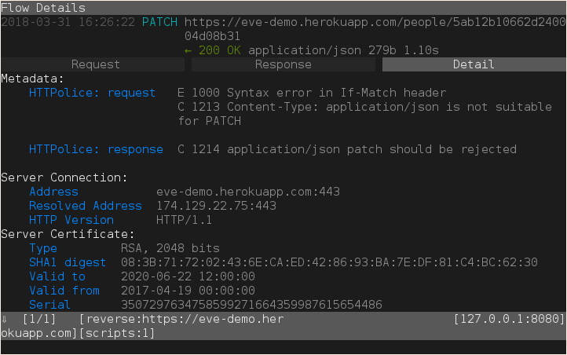

Quickstart
==========

.. highlight:: console

Installation
------------

HTTPolice is a Python package that can be installed with pip
(on Python 2.7 or 3.4+)::

  $ pip install HTTPolice

If you’re not familiar with pip, check the manual’s :doc:`install` section.

Using HAR files
---------------

Let’s start with something easy.

If you’re running Google Chrome, Firefox, or Microsoft Edge,
you can use their developer tools to export HTTP requests and responses
as a `HAR file`__, which can then be analyzed by HTTPolice.

__ https://en.wikipedia.org/wiki/.har

For example, in Firefox,
press F12 to open the toolbox, and switch to its Network pane.
Then, open a simple Web site—I’m going to use `h2o.examp1e.net`__ here.
All HTTP exchanges made by the browser appear in the Network pane.
Right-click inside that pane and select “Save All As HAR”.

__ https://h2o.examp1e.net/

Then feed this HAR file to HTTPolice::

  $ httpolice -i har /path/to/file.har
  ------------ request: GET /search/searchindex.js
  C 1032 Host should be the first header
  ------------ request: GET /analytics.js
  ------------ response: 200 OK
  C 1299 Quoted comma in Alt-Svc might confuse a naive parser
  C 1035 Deprecated media type text/javascript
  C 1258 HTTP/2 should use ALTSVC frame instead of Alt-Svc header
  D 1168 Age header implies response from cache
  E 1173 Response to "Cache-Control: no-cache" can't be served from cache
  ------------ request: GET /repos/h2o/h2o?callback=callback
  ------------ response: 200 OK
  C 1277 Obsolete 'X-' prefix in headers
  ------------ request: GET /r/collect?v=1&_v=j66&a=1028424992&t=pageview&_s=1...
  ------------ response: 200 OK
  E 1108 Wrong day of week in Expires
  C 1299 Quoted comma in Alt-Svc might confuse a naive parser
  C 1162 Pragma: no-cache is for requests
  C 1258 HTTP/2 should use ALTSVC frame instead of Alt-Svc header

Better reports
--------------

By default, HTTPolice prints a simple text report
which may be hard to understand.
Use the ``-o html`` option to make a detailed HTML report instead.
You will also need to redirect it to a file::

  $ httpolice -i har -o html /path/to/file.har >report.html

Open ``report.html`` in your Web browser and enjoy.

Using mitmproxy
---------------

What if you have an HTTP API that is accessed by special clients?
Let’s say curl is special enough::

  $ curl -ksi \
  >   -X PATCH https://eve-demo.herokuapp.com/people/5ab12b10662d240004d08b31 \
  >   -H 'Content-Type: application/json' \
  >   -H 'If-Match: 9f5cdb43a57b04abe342f6a425260f5e6adae359' \
  >   -d '{"firstname": "John"}'
  HTTP/1.1 200 OK
  Connection: keep-alive
  Content-Type: application/json
  Content-Length: 279
  Etag: "9a056970404b9dd20c94c274fbdd6db2239800ac"
  Server: Eve/0.7.6 Werkzeug/0.10.4 Python/2.7.4
  Date: Sat, 31 Mar 2018 13:23:08 GMT
  Via: 1.1 vegur

  {"_updated": "Sat, 31 Mar 2018 13:23:08 GMT", "_id": "5ab12b10662d240004d08b31", "_links": {"self": {"title": "person", "href": "people/5ab12b10662d240004d08b31"}}, "_status": "OK", "_etag": "9a056970404b9dd20c94c274fbdd6db2239800ac", "_created": "Tue, 20 Mar 2018 15:38:56 GMT"}

How do you get this into HTTPolice?

One way is to use `mitmproxy`__, an advanced tool for inspecting HTTP traffic.
Install it in a Python 3.5+ environment with HTTPolice integration::

  $ pip3 install mitmproxy-HTTPolice

See also the instructions for `installing mitmproxy via pip3`__.

__ https://mitmproxy.org/
__ https://docs.mitmproxy.org/stable/overview-installation/#installation-on-linux-via-pip3

.. admonition:: Doesn’t work on Windows

   Try the `Windows Subsystem for Linux`__, or use `Fiddler`__ instead
   (Fiddler’s `HAR 1.2 export`__ can get your data into HTTPolice).

   __ https://docs.microsoft.com/en-us/windows/wsl/about
   __ http://www.telerik.com/fiddler
   __ http://docs.telerik.com/fiddler/KnowledgeBase/ImportExportFormats

The following command will start mitmproxy as a reverse proxy
in front of your API on port 8080, with HTTPolice integration::

  $ mitmproxy --mode reverse:https://eve-demo.herokuapp.com \
  >   -s "`python3 -m mitmproxy_httpolice`"

Now tell your client to talk to port 8080 instead of directly to the API::

  $ curl -ksi \
  >   -X PATCH https://localhost:8080/people/5ab12b10662d240004d08b31 \
  >   -H 'Content-Type: application/json' \
  >   -H 'If-Match: 9a056970404b9dd20c94c274fbdd6db2239800ac' \
  >   -d '{"firstname": "Sam"}'

In mitmproxy, you will see that it has intercepted the exchange.
Open its details (Enter → Tab → Tab) to see the HTTPolice report on it:

Django integration
------------------

Suppose you’re building a Web application with `Django`__ (1.11+).
You probably have a test suite
that makes requests to your app and checks responses.
You can easily instrument this test suite with HTTPolice
and get instant feedback when you break the protocol.

__ https://www.djangoproject.com/

::

  $ pip install Django-HTTPolice

.. highlight:: py

Add the HTTPolice middleware to the top of your middleware list::

  MIDDLEWARE = [
      'django_httpolice.HTTPoliceMiddleware',
      'django.middleware.common.CommonMiddleware',
      # ...
  ]

Add a couple settings::

  HTTPOLICE_ENABLE = True
  HTTPOLICE_RAISE = 'error'

.. highlight:: console

Now let’s run the tests and see what’s broken::

  $ python manage.py test
  ...E
  ======================================================================
  ERROR: test_query_plain (example_app.test.ExampleTestCase)
  ----------------------------------------------------------------------
  Traceback (most recent call last):
    [...]
    File "[...]/django_httpolice/middleware.py", line 92, in process_response
      raise ProtocolError(exchange)
  django_httpolice.common.ProtocolError: HTTPolice found problems in this response:
  ------------ request: GET /api/v1/words/?query=er
  C 1070 No User-Agent header
  ------------ response: 200 OK
  E 1038 Bad JSON body

  ----------------------------------------------------------------------
  Ran 4 tests in 0.380s

  FAILED (errors=1)

In `this example`__, the app sent a wrong ``Content-Type`` header
and HTTPolice caught it.

__ https://github.com/vfaronov/django-httpolice/blob/d382aa7/example/example_app/views.py#L43

More options
------------

There are other ways to get your data into HTTPolice.
Check the :doc:`full manual <index>`.
